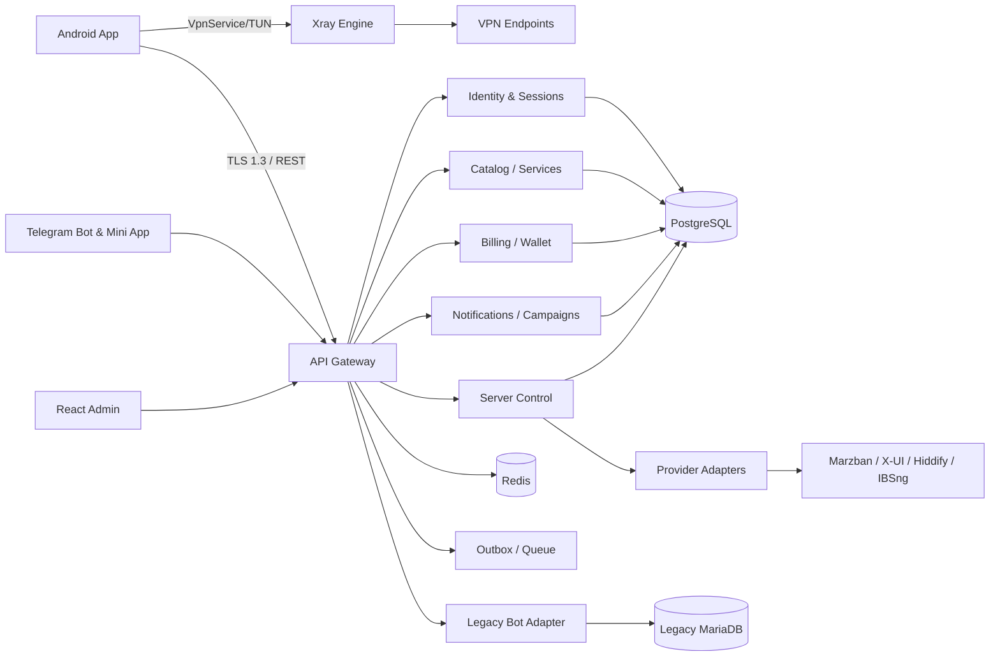
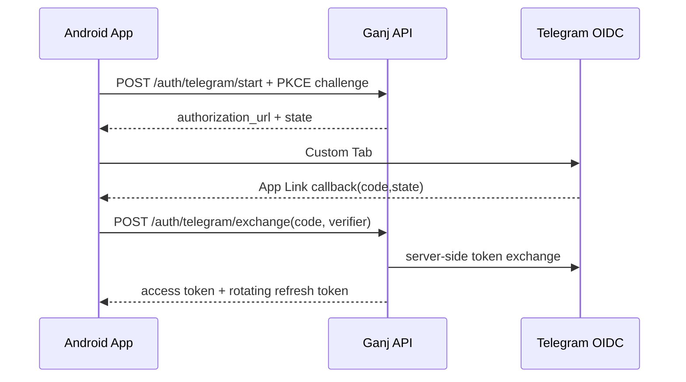

# Architecture Document

## 1. Context

Ganj VPN باید در شبکه‌های ناپایدار، محدود و دارای Packet Loss کار کند؛ هم‌زمان فروش، Telegram و Marketing را ارائه دهد بدون اینکه خرابی آن‌ها VPN را از کار بیندازد. بنابراین Data Plane و Control Plane جدا هستند.



## 2. Architectural Style

### Backend

Modular Monolith با مرزهای Domain روشن؛ Microservice از روز اول ممنوع. هر ماژول Schema/Service/Policy/Event خود را دارد و ارتباط بین ماژول‌ها فقط از Interface و Domain Event است.

ماژول‌ها:

- Identity
- Users & Devices
- Catalog & Pricing
- Subscriptions & Entitlements
- VPN Servers & Health
- Services & Config Broker
- Smart Connect
- Orders & Payments
- Wallet Ledger
- Notifications & Campaigns
- Support
- Audit & Security
- Legacy Integration

### Android

```text
:app
:core:model
:core:network
:core:database
:core:security
:core:designsystem
:core:telemetry
:vpn:api
:vpn:xray
:vpn:service
:feature:onboarding
:feature:home
:feature:servers
:feature:connect
:feature:store
:feature:account
:feature:settings
:benchmark
```

Unidirectional Data Flow با Immutable State و Event/Effect. UI هیچ API مربوط به Xray را مستقیم صدا نمی‌زند و فقط به `VpnEngine` وابسته است.

## 3. VPN Data Plane

### Engine Contract

```kotlin
interface VpnEngine {
    val state: StateFlow<VpnState>
    suspend fun validate(profile: SealedConnectionProfile): ValidationResult
    suspend fun probe(candidates: List<ProbeTarget>): List<ProbeResult>
    suspend fun connect(profile: SealedConnectionProfile, policy: RoutingPolicy)
    suspend fun disconnect(reason: DisconnectReason)
    suspend fun stats(): LocalConnectionStats
}
```

- Xray-core از Source و Commit پین‌شده Build می‌شود.
- Wrapper حداقل سطح API را دارد و فایل‌های تغییرکردهٔ MPL قابل انتشار/ردیابی‌اند.
- Config فقط در حافظه باز می‌شود و در Log/Crash dump چاپ نمی‌شود.
- ارتباط Loopback بین `VpnService` و Core از Network Security عمومی جداست.
- DNS به‌طور پیش‌فرض داخل Tunnel؛ Ruleهای Direct باید صریح و قابل مشاهده باشند.

### Protocol Matrix MVP

| Protocol | MVP | Transport/Security |
|---|---:|---|
| VLESS | Yes | TCP, WS, gRPC, XHTTP; TLS/REALITY |
| VMess | Yes | TCP, WS, gRPC |
| Trojan | Yes | TCP, WS, gRPC + TLS |
| Shadowsocks | Yes | TCP/UDP supported ciphers |
| WireGuard | Later | Phase 2 after Xray parity |

## 4. Smart Connect

### مراحل

1. Backend فقط سرورهای مجاز Plan/Region/Protocol را برمی‌گرداند.
2. Client حداکثر 8 کاندید را با concurrency=4 می‌سنجد.
3. Probe شامل DNS resolution، TCP/TLS handshake، latency jitter و packet success است؛ ICMP شرط نیست.
4. Backend load و capacity به نتیجه Client اضافه می‌شود.
5. Score با EWMA و Hysteresis محاسبه می‌شود تا Server flapping رخ ندهد.

### امتیاز

مقادیر Normalize شده بین صفر و یک هستند و امتیاز بیشتر بهتر است:

```text
score = 0.33*latency + 0.18*packet_success + 0.22*capacity
      + 0.15*throughput_hint + 0.07*region_affinity + 0.05*stability
```

- Server جدید فقط اگر حداقل 12% بهتر باشد جایگزین اتصال فعلی می‌شود.
- Failover در دو Failure متوالی و با Cooldown انجام می‌شود.
- Region از IP سمت سرور به‌صورت coarse و کوتاه‌عمر است؛ Location permission درخواست نمی‌شود.

## 5. Identity and Telegram

مسیر اصلی Native:



Fallback Bot Link:

- API یک opaque nonce 256-bit با TTL پنج دقیقه ایجاد می‌کند.
- لینک `t.me/<bot>?start=<base64url nonce>` باز می‌شود.
- Bot فقط Hash nonce را Consume و Account را Link می‌کند.
- App با backoff وضعیت را Poll می‌کند؛ Token هرگز داخل deep link قرار نمی‌گیرد.

## 6. Tokens and Device Binding

- Access token: JWT کوتاه‌عمر 10 دقیقه، `aud`, `iss`, `jti`, scope و device ID.
- Refresh token: opaque 256-bit، 30 روز، فقط Hash در DB، Rotation در هر استفاده.
- Reuse detection کل Token Family را لغو می‌کند.
- Device یک کلید hardware-backed ایجاد و Challengeهای حساس را امضا می‌کند.
- Root/Emulator/Play Integrity فقط Risk Signal است؛ قطع خودکار کاربران سالم ممنوع.

## 7. Config Broker

Endpoint لیست سرویس Config خام برنمی‌گرداند. برای اتصال:

1. App nonce و public key دستگاه را ارسال می‌کند.
2. Backend Entitlement، Device limit و Server state را بررسی می‌کند.
3. یک profile کوتاه‌عمر با `profile_id`, `expires_at`, `server`, `protocol payload` می‌سازد.
4. Payload با کلید نشست دستگاه Seal می‌شود.
5. App آن را داخل Keystore context باز و فقط در حافظه به Core می‌دهد.

## 8. Legacy Integration

`LegacyBotAdapter` تنها Component مجاز برای دسترسی به Schema قدیمی است. هیچ Mobile endpoint مستقیم به فایل PHP قدیمی متصل نمی‌شود.

- Read-through برای User/Invoice/Product؛
- Mapping پایدار در `legacy_links`؛
- Dual-write فقط با Outbox و Idempotency؛
- Reconciliation روزانه Balance، Service expiry و Payment؛
- Feature flag برای Cutover هر Domain؛
- Rollback با بازگرداندن Read owner، نه Undo دستی داده.

## 9. Resilience

- API timeout زیر 5 ثانیه و Retry فقط برای عملیات Idempotent.
- خرید، تمدید و Wallet با Idempotency Key اجباری.
- Server health با Circuit Breaker و Bulkhead per provider.
- Bootstrap cache امضاشده اجازه می‌دهد اپ در قطعی Control Plane به سرویس موجود وصل شود.
- FCM منبع حقیقت نیست؛ فقط Signal برای Sync است.

## 10. Observability and Privacy

مجاز:

- startup/connection duration، error code طبقه‌بندی‌شده، app version، device class؛
- server ID داخلی، protocol family و aggregated success rate؛
- billing/audit eventهای ضروری.

ممنوع:

- destination host/IP، DNS query، URL، traffic content؛
- config URI، UUID/password، Telegram initData، access/refresh token؛
- raw public IP در Analytics یا Log بلندمدت.

## 11. Deployment

- API و Worker داخل Container؛ PostgreSQL HA و Redis با persistence متناسب.
- Admin پشت MFA و IP/risk-aware controls.
- Secrets در Secret Manager، نه `.env` داخل Artifact.
- Blue/Green یا Canary برای API؛ Staged rollout برای Android.
- Database migration به‌صورت expand → migrate → contract.

## منابع معماری/حقوقی

- [Xray-core — MPL-2.0](https://github.com/XTLS/Xray-core)
- [v2rayNG — GPL-3.0](https://github.com/2dust/v2rayNG)
- [Telegram Login OIDC + PKCE](https://core.telegram.org/bots/telegram-login)
- [Telegram Mini App validation](https://core.telegram.org/bots/webapps#validating-data-received-via-the-mini-app)

