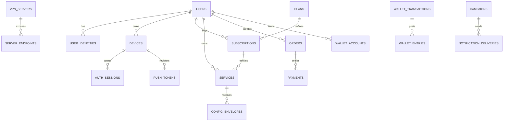

# Database Schema

نسخه ماشینی: [`database/schema.sql`](../database/schema.sql)

## اصول مدل داده

- ID داخلی UUIDv7؛ Telegram ID به‌عنوان Identity خارجی، نه Primary Key.
- پول با `BIGINT` در کوچک‌ترین واحد و Currency جدا؛ Float ممنوع.
- Wallet به‌صورت Double-entry ledger؛ Balance مشتق‌شده و Cache قابل تطبیق.
- Config secret با Envelope Encryption و Key version نگهداری می‌شود.
- Soft delete فقط برای Domainهای لازم؛ Audit append-only.
- تمام timestampها UTC با `timestamptz`.
- عملیات خارجی با Idempotency key و Transactional Outbox.

## Domain Map

## جداول اصلی

### Identity

- `users`: پروفایل داخلی، locale، status، risk state.
- `user_identities`: Telegram/OIDC/Guest/Google Play identity با unique provider subject.
- `devices`: کلید عمومی دستگاه، platform، app version، integrity state.
- `auth_sessions`: refresh token hash/family، expiry، revoke و last seen.
- `auth_challenges`: OIDC state/PKCE و bot-link nonce کوتاه‌عمر.

### Catalog and Entitlement

- `plans`, `plan_prices`, `plan_server_rules`.
- `subscriptions`: وضعیت اشتراک تجاری و منبع خرید.
- `services`: سرویس عملیاتی قابل اتصال.
- `service_entitlements`: محدودیت device/traffic/server/protocol.

### VPN

- `vpn_servers`: country/city/tier/capacity/status/provider.
- `server_endpoints`: protocol/transport/public host/port و Secret reference.
- `server_health_samples`: داده کوتاه‌عمر و Aggregated؛ بدون مقصد کاربر.
- `config_envelopes`: ciphertext، key version، profile expiry.
- `connection_sessions`: فقط زمان/سرور/error/bytes aggregate؛ بدون destination.
- `usage_counters`: دوره مصرف و source of truth.

### Commerce

- `orders`, `order_items`, `payments`, `refunds`.
- `wallet_accounts`, `wallet_transactions`, `wallet_entries`.
- `play_purchases`: purchase token hash و entitlement state.

### Messaging

- `push_tokens`, `notifications`, `campaigns`, `campaign_audiences`, `campaign_creatives`, `notification_deliveries`.
- `user_consents`: channel/purpose/version/timestamp.

### Operations

- `provider_connections`: Secret reference برای Marzban/X-UI/... .
- `legacy_links`: mapping مدل قدیم و جدید.
- `idempotency_keys`, `outbox_events`, `audit_logs`, `security_events`.

## Retention

| Data | Retention |
|---|---|
| Access token | 10 minutes |
| Refresh session after expiry/revoke | 30 days security window |
| Raw server health samples | 7 days |
| Aggregated capacity | 13 months |
| Connection session metadata | 30 days default; configurable |
| Destination/DNS/content | Never collected |
| Payment/Audit | مطابق الزام مالی/حقوقی، حداقل‌سازی‌شده |
| Push delivery details | 90 days |
| Security events | 180 days with redaction |

## Concurrency Rules

- Wallet transaction با unique business key و deferred balance constraint.
- Purchase fulfillment با `SELECT ... FOR UPDATE` روی order/subscription.
- Device limit در transaction و با advisory lock per user/service.
- Usage counter با upsert atomic و monotonic source sequence.
- Outbox در همان transaction دامنه نوشته و worker با `SKIP LOCKED` ارسال می‌کند.

